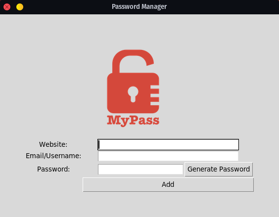

# Password Manager

This is a simple password manager application built with Python and Tkinter. It generates random passwords and saves them along with website and email information to a text file. 

## Features
- Generate strong passwords with letters, numbers, and symbols.
- Save website and email information along with passwords.
- Error handling for empty fields.
- Confirmation dialog before saving information.
- Clear password field when generating a new password.

## Installation
1. Clone the repository: `git clone https://github.com/username/repo.git`
2. Install required packages: `pip install -r requirements.txt`
3. Run the application: `python password_manager.py`

## Usage
1. Enter website and email information.
2. Click "Generate Password" to generate a strong password.
3. Click "Add" to save the information.
4. Confirm the details and click "OK" to save to the text file.

## Credits
- This application was built as part of a project in a Python course on [Udemy](https://www.udemy.com/course/100-days-of-code/).
- The logo image used in the application is from [Flaticon](https://www.flaticon.com/).
- The requirements for the application are listed in the `requirements.txt` file and were generated using [pipreqs](https://github.com/bndr/pipreqs).